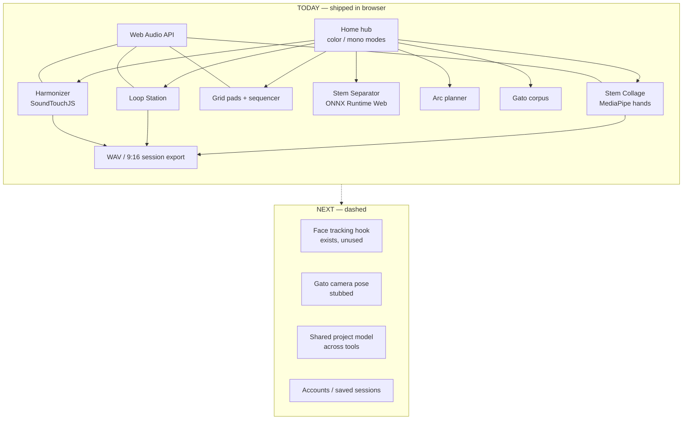
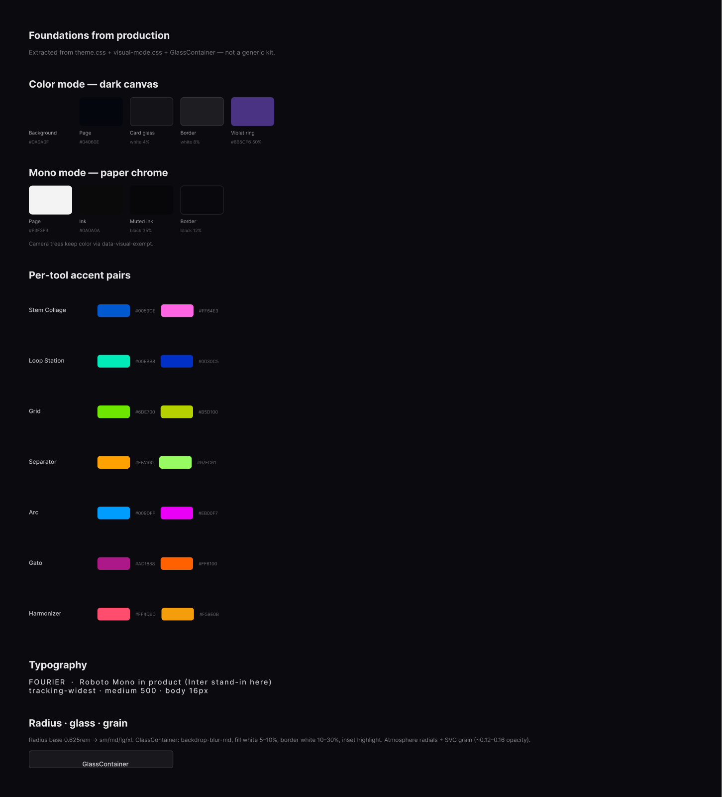
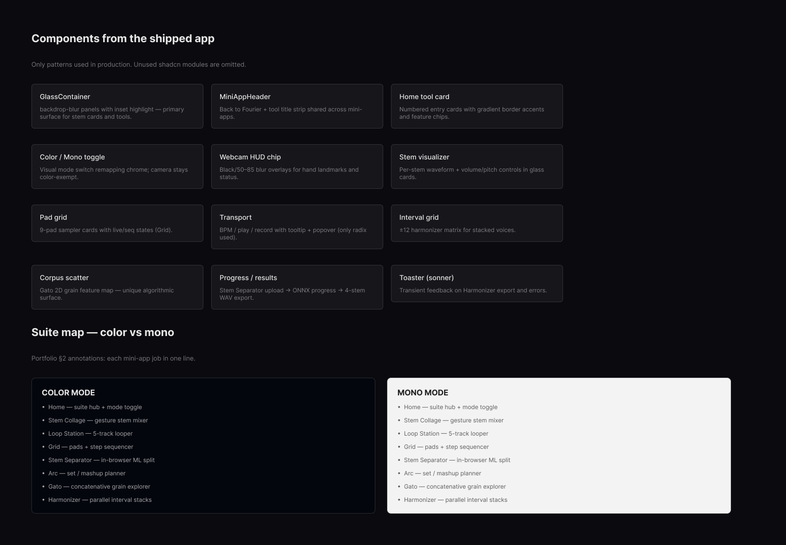

# Fourier

Browser-native music tools with computer vision — a suite of mixers, loopers, samplers, and ML-powered utilities that run entirely in the browser. Fourier started as Matte Projects R&D for Replit’s **VibeCon 2026** workshop and is the prototype I fully productized as a design-engineering showcase.

## Links

| | |
|---|---|
| **Live app** | [fourier-sound.vercel.app](https://fourier-sound.vercel.app/) |
| **Portfolio case study** | [treybradley.xyz/matte-projects-ai-vibecoding-rd](https://www.treybradley.xyz/matte-projects-ai-vibecoding-rd) |
| **Design system (Figma)** | [Fourier — Design System & Architecture](https://www.figma.com/design/lOA7qbbZngiZhPcbqnAmhk) |
| **Source** | [github.com/treybradley/Fourier](https://github.com/treybradley/Fourier) |

## Architecture

Everything runs client-side today. Dashed items are next / unfinished.



## Design system

Extracted from the **shipped product**, not a speculative kit. Roboto Mono, near-black canvas, glass panels, per-tool accent atmospheres, and a first-class **color ↔ mono** visual mode. Full file: [Figma](https://www.figma.com/design/lOA7qbbZngiZhPcbqnAmhk).

### Foundations

Dark canvas (`#0A0A0F` / `#04060E`), white-alpha glass and borders, violet focus ring, grain + radial atmospheres, and mono paper remap (`#F3F3F3`). Tool accents (blue→pink collage, teal→blue looper, lime grid, etc.) live on hub cards and page atmospheres.



### Components

Only patterns the app actually uses (most of the shadcn folder is unused and omitted):

| Pattern | Role |
|--------|------|
| **GlassContainer** | Primary blurred surface for cards and tools |
| **MiniAppHeader** | Back-to-Fourier chrome across mini-apps |
| **Home tool cards** | Numbered entries with gradient accents + chips |
| **Color / Mono toggle** | Suite-wide visual mode |
| **Webcam HUD** | Hand landmarks / status overlays |
| **Transport / pads** | Grid sequencer controls (tooltip + popover) |
| **Corpus / interval grids** | Gato scatter + Harmonizer ±12 matrix |
| **Separator progress** | ONNX upload → 4-stem results |



**Figma pages:** Cover · Foundations · Components · Architecture · Desktop Wireframes (IA only).

## Features

- **Stem Collage** — multi-stem mixer with optional MediaPipe hand control  
- **Loop Station** — RC-505-inspired multi-track looper  
- **Grid** — 9-pad sampler + step sequencer  
- **Stem Separator** — in-browser ONNX vocal/drums/bass/other split  
- **Arc** — DJ set / mashup planning workspace  
- **Gato** — concatenative synthesis corpus explorer  
- **Harmonizer** — parallel interval stacks + export  

## Tech stack

React 18 · Vite 6 · TypeScript · Tailwind 4 · React Router 7 · Web Audio API · MediaPipe Tasks Vision · ONNX Runtime Web · SoundTouchJS · Motion

## Running locally

```bash
npm i
npm run dev
```

## License / attributions

See [ATTRIBUTIONS.md](./ATTRIBUTIONS.md).
